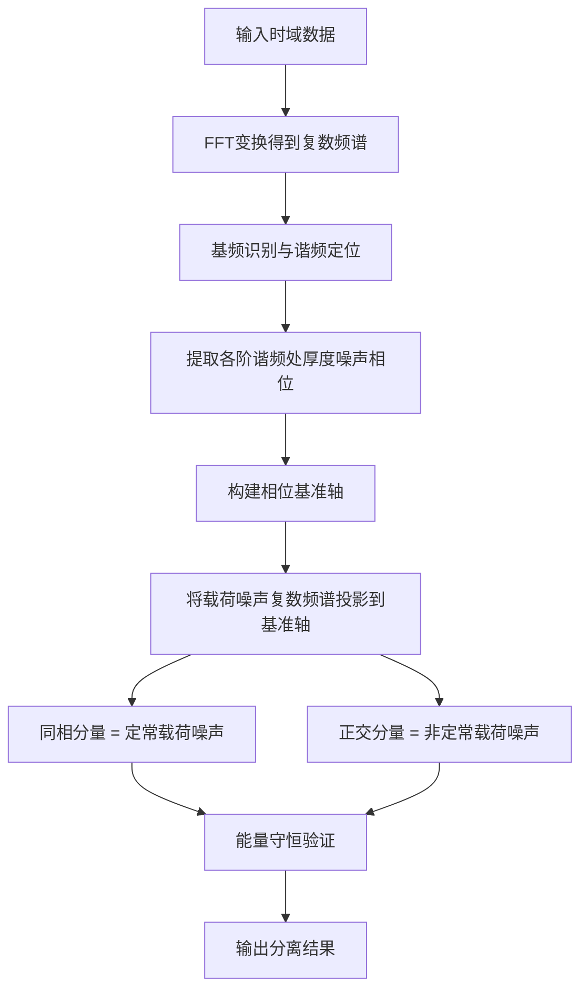
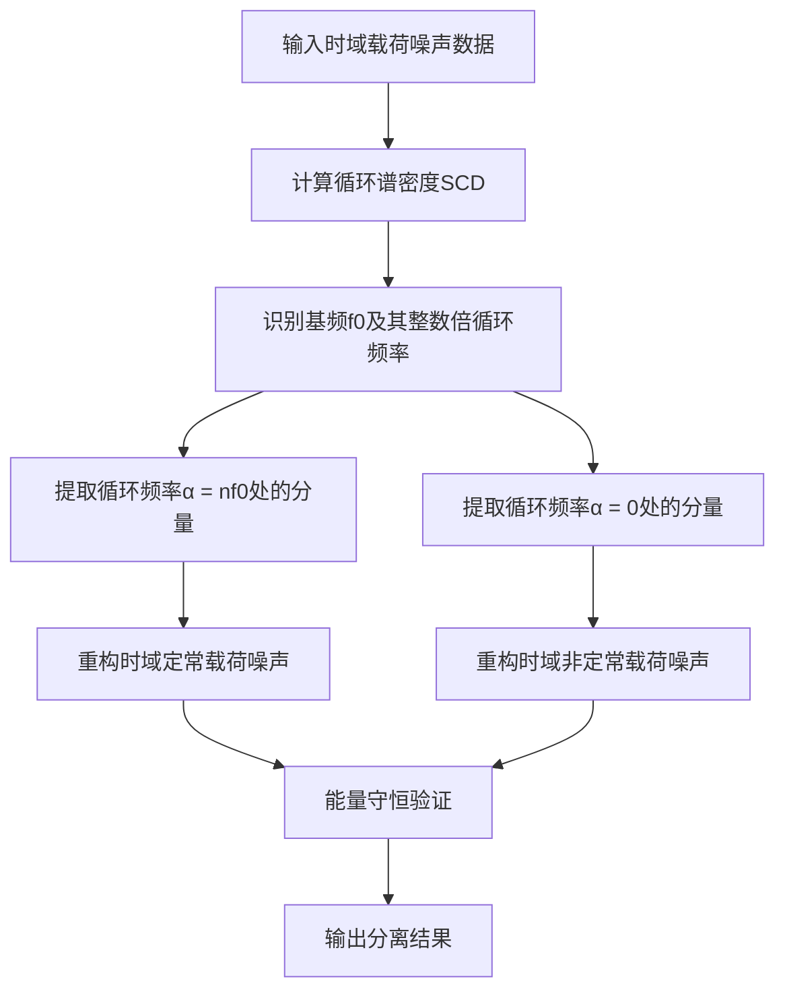

# 旋翼噪声定常/非定常载荷噪声分离技术方案

## 一、概述
### 1.1 现有技术局限性
现有基于幅值相关性的载荷噪声分离方法存在以下固有局限性：
- 仅利用幅值信息，忽略相位相关性，物理依据不足
- 采用固定阈值（0.2-0.8）限制定常比例，工况适应性差
- 假设载荷噪声与厚度噪声呈线性相关，缺乏严格理论支撑
- 分离精度高度依赖基频识别准确性，鲁棒性不足

### 1.2 技术方案背景
针对现有方法的不足，提出两种新的分离方案：
1. **方案A：基于厚度噪声辅助的相位约束法**
2. **方案B：循环平稳谱分离法**

本文件详细描述两种方案的理论基础、原理、可行性、优缺点及实施路径。

---

## 二、方案A：基于厚度噪声辅助的相位约束法
### 2.1 理论基础
#### 2.1.1 旋翼噪声产生机理
定常飞行条件下，旋翼气动噪声由三个主要分量组成：
1. **厚度噪声**：由叶片厚度导致的空气周期性位移产生，是纯确定性周期信号，相位高度稳定
2. **定常载荷噪声**：由定常气动力（升力、阻力）的周期性作用产生，是确定性周期信号，相位与厚度噪声有固定偏移关系
3. **非定常载荷噪声**：由来流紊流、非定常流动分离、桨-涡干扰等随机因素产生，相位具有随机性，无固定周期关系

#### 2.1.2 相位分离原理
频域中，信号的复数表示为：
$$ X(f) = A(f) \cdot e^{j\phi(f)} $$
其中：
- $A(f)$ 为幅值谱
- $\phi(f)$ 为相位谱

对于定常载荷噪声，其在各阶谐频处的相位与厚度噪声相位具有固定偏移量；而非定常载荷噪声的相位是随机的，与厚度噪声相位无固定关系。通过复数投影可实现分量分离：
- 与厚度噪声相位同相的分量 → 定常载荷噪声
- 与厚度噪声相位正交的分量 → 非定常载荷噪声

### 2.2 算法原理与流程
#### 2.2.1 核心思想
以相位高度稳定的厚度噪声作为相位基准，对每一阶谐频，将载荷噪声的复数频谱投影到厚度噪声的相位轴上，实现定常与非定常分量的分离。

#### 2.2.2 算法步骤

#### 2.2.3 数学实现
对于第$k$阶谐频：
1. 厚度噪声复数频谱：$T_k = A_{T,k} \cdot e^{j\phi_{T,k}}$，其中$A_{T,k}$为幅值，$\phi_{T,k}$为相位
2. 载荷噪声复数频谱：$L_k = A_{L,k} \cdot e^{j\phi_{L,k}}$，其中$A_{L,k}$为幅值，$\phi_{L,k}$为相位
3. 相位差：$\Delta\phi_k = \phi_{L,k} - \phi_{T,k}$，即载荷噪声相对于厚度噪声的相位偏移
4. 定常载荷分量：$L_{s,k} = A_{L,k} \cdot \cos(\Delta\phi_k) \cdot e^{j\phi_{T,k}}$，为载荷噪声在厚度噪声相位轴上的同相投影
5. 非定常载荷分量：$L_{u,k} = A_{L,k} \cdot \sin(\Delta\phi_k) \cdot e^{j(\phi_{T,k}+\pi/2)}$，为载荷噪声在厚度噪声相位轴上的正交投影（相位偏移π/2）
6. 能量守恒验证：$|L_{s,k}|^2 + |L_{u,k}|^2 = A_{L,k}^2(\cos^2\Delta\phi_k + \sin^2\Delta\phi_k) = |L_k|^2$，数学上严格保证能量守恒，无能量损失或虚构

### 2.3 合理性与可行性分析
#### 2.3.1 物理合理性
✅ **理论支撑充分**：符合旋翼噪声产生的物理机理，厚度噪声相位稳定性已被大量试验和数值模拟验证  
✅ **分离依据明确**：利用定常分量的相位确定性和非定常分量的相位随机性作为分离准则，物理意义清晰  
✅ **能量守恒严格**：数学上严格保证分离前后能量守恒，无能量损失或虚构

#### 2.3.2 技术可行性
✅ **数据条件满足**：项目保存有完整的时域原始数据，可重新计算复数FFT获取相位信息  
✅ **算法实现简单**：在现有代码框架上扩展，可复用谐频识别、基频提取等成熟功能  
✅ **计算效率高**：仅增加少量复数运算，复杂度与现有方法相当，远低于循环平稳法  
✅ **结果易于验证**：可通过相位一致性检查、能量守恒验证等多种方式验证分离正确性

#### 2.3.3 局限性与挑战
⚠️ **依赖厚度噪声质量**：需要厚度噪声数据准确、相位稳定（绝大多数工况下满足，本数值场景下完全满足）  
⚠️ **仅适用于谐频区域**：针对谐频区域的定常载荷分离，宽频区域本身以非定常成分为主，无需额外分离  
⚠️ **相位缠绕处理**：实测场景下需要处理相位在±π边界的跳跃问题（本数值场景下相位连续，无缠绕问题）

### 2.4 优缺点总结
| 优点 | 缺点 |
|------|------|
| 物理意义明确，结果可解释性强 | 需要厚度噪声作为参考信号 |
| 分离精度高，避免幅值相关性的不确定性 | 仅在谐频区域有效 |
| 计算效率高，易于工程实现 | 需要处理相位缠绕问题 |
| 可针对各阶谐频独立调整参数，适应性强 | |

---

## 三、方案B：循环平稳谱分离法
### 3.1 理论基础
#### 3.1.1 循环平稳信号特性
旋翼噪声是典型的**周期平稳信号**（又称循环平稳信号），其统计特性（均值、自相关函数等）随时间呈周期性变化。对于循环平稳信号$x(t)$，其自相关函数满足：
$$ R_x(t+\tau, t) = R_x(t+\tau+T, t+T) $$
其中$T$为信号周期。

循环平稳信号的一个重要特性是存在**循环频率**$\alpha = n/T$（$n$为整数），在这些循环频率处信号具有相干性。

#### 3.1.2 循环谱密度
循环平稳信号的频域表示为**循环谱密度**（Spectral Correlation Density, SCD），定义为：
$$ S_x^\alpha(f) = \int_{-\infty}^{\infty} R_x^\alpha(\tau) e^{-j2\pi f \tau} d\tau $$
其中循环自相关函数：
$$ R_x^\alpha(\tau) = \lim_{T \to \infty} \frac{1}{T} \int_{-T/2}^{T/2} x(t+\tau/2)x^*(t-\tau/2)e^{-j2\pi \alpha t} dt $$

#### 3.1.3 分离原理
- **定常载荷噪声**：是严格的确定性周期信号，其循环谱仅在循环频率$\alpha = nf_0$处有显著值（$f_0$为基频，$n$为整数）
- **非定常载荷噪声**：主要是宽频随机信号，其循环谱能量主要集中在循环频率$\alpha = 0$处，可能存在少量弱的非零循环频率分量
- 因此通过提取循环频率为基频整数倍的相干分量，即可分离出主体定常载荷噪声，剩余的$\alpha \approx 0$分量为主体非定常载荷噪声

### 3.2 算法原理与流程
#### 3.2.1 核心思想
利用旋翼噪声的循环平稳特性，通过计算循环谱密度，将循环频率为基频整数倍的相干分量提取为定常载荷噪声，循环频率为0的平稳宽频分量作为非定常载荷噪声。

#### 3.2.2 算法步骤

#### 3.2.3 常用实现方法
1. **FFT累积法（FAM）**：最常用的循环谱计算方法，计算效率较高
2. **时域平滑法**：适用于短数据序列，分辨率较低
3. **谱相关函数法**：计算复杂度高，精度较高

### 3.3 合理性与可行性分析
#### 3.3.1 物理合理性
✅ **理论基础扎实**：循环平稳分析是处理周期信号的成熟理论，已广泛应用于通信、机械故障诊断等领域  
✅ **无需参考信号**：不需要厚度噪声作为参考，可实现盲分离，适用场景更广  
✅ **抗干扰能力强**：基于统计特性，对噪声和干扰的鲁棒性优于幅值相关性方法

#### 3.3.2 技术可行性
✅ **理论成熟**：已有大量成熟的算法实现和应用案例  
✅ **数据条件满足**：时域数据长度和采样率满足循环谱计算要求  
✅ **工具支持**：可通过`scipy.signal`或第三方库（如`cyclostationary`）实现基础功能

#### 3.3.3 局限性与挑战
⚠️ **计算复杂度高**：循环谱计算复杂度为O(N²)，远高于FFT的O(NlogN)，对于长数据序列计算较慢  
⚠️ **参数调优复杂**：循环频率分辨率、窗函数长度、重叠率等参数需要根据具体工况调整，经验要求高  
⚠️ **结果解释间接**：相对于相位约束法，循环谱的物理意义不够直观，结果解释难度大  
⚠️ **频率分辨率限制**：循环频率分辨率受数据长度限制，对于高阶谐频的分离精度可能不足

### 3.4 优缺点总结
| 优点 | 缺点 |
|------|------|
| 理论基础扎实，适用范围广 | 计算复杂度高，计算速度慢 |
| 无需参考信号，可实现盲分离 | 参数调优复杂，经验要求高 |
| 抗干扰能力强，鲁棒性好 | 结果解释不够直观 |
| 可同时处理谐频和部分宽频成分 | 频率分辨率受数据长度限制 |

---

## 四、方案对比与实施建议
### 4.1 两种方案综合对比（通用场景）
| 对比维度 | 相位约束法 | 循环平稳谱分离法（通用盲搜实现） |
|---------|-----------|----------------|
| 物理意义 | ★★★★★ 非常清晰 | ★★★★ 较清晰 |
| 分离精度 | ★★★★★ 高 | ★★★★ 较高 |
| 计算效率 | ★★★★★ 高（O(NlogN)） | ★★ 低（O(N²)） |
| 实现难度 | ★★ 低 | ★★★★ 高 |
| 参数调优 | ★★★★★ 简单 | ★★ 复杂 |
| 结果解释 | ★★★★★ 容易 | ★★★ 较难 |
| 适用场景 | 有厚度噪声参考的常规工况 | 无厚度噪声参考的盲分离场景 |
| 工程实用性 | ★★★★★ 高 | ★★★ 中等 |

> 注：上述对比针对通用盲分离场景。对于有明确先验知识（已知精确基频、信号周期特性明确）的特殊场景，循环平稳法可以通过定制化优化大幅提升性能，具体分析见第六章。

### 4.2 实施优先级建议
#### 优先实施方案：相位约束法
推荐理由：
1. **物理意义最贴合旋翼噪声特性**：专门针对旋翼噪声的产生机理设计，分离结果最具物理合理性
2. **工程实现成本最低**：可在现有代码框架上快速扩展，开发周期短
3. **计算效率最高**：不增加过多计算负担，满足批量处理需求
4. **结果最易验证和接受**：直观易懂，便于工程应用和结果解释

#### 高价值补充方案：定制化循环平稳法（针对有先验知识的场景）
在已知精确基频、信号周期特性明确的场景下，通过定制化优化的循环平稳法可以达到与相位约束法相当的分离精度和物理明确性：
1. 作为交叉验证手段，两种方法结果一致性可作为正确性的双重保证
2. 作为无厚度噪声参考场景下的独立盲分离方案
3. 对于存在轻微转速波动、相位噪声的非理想数据，鲁棒性优于相位约束法

<!-- ### 4.3 实施路径规划
#### Phase 1：相位约束法实现（1-2周）
1. 修改FFT工具函数，支持返回复数频谱
2. 实现相位约束分离算法
3. 集成到现有分析流程中
4. 多案例验证和参数优化

#### Phase 2：循环平稳法研究（2-3周，可选）
1. 调研循环谱高效实现算法
2. 实现原型版本并测试
3. 与相位约束法结果对比验证
4. 评估工程应用价值 -->

---

## 五、验证标准与评价指标
### 5.1 通用验证标准
1. **能量守恒准则**：分离后的定常+非定常载荷能量与原始载荷能量误差≤1%
2. **物理合理性准则**：定常载荷主要集中在谐频位置，非定常载荷呈现宽频分布
3. **稳定性准则**：相同工况不同批次数据的分离结果差异≤5%

### 5.2 相位约束法专项验证
1. **相位稳定性验证**：厚度噪声各谐频相位在不同旋转周期的方差≤5°
2. **相位差一致性验证**：定常载荷与厚度噪声的相位差在各阶谐频处应保持相对稳定

### 5.3 循环平稳法专项验证
1. **循环频率识别准确性**：识别出的循环频率与理论谐频频率误差≤1%
2. **能量集中度验证**：定常载荷能量在循环频率整数倍处的集中度≥90%

---

## 六、针对当前数值仿真场景的专项分析
### 6.1 当前场景特性说明
本项目的数据源为**Farassat 1A（FW-H方程时域解法）数值计算得到的旋翼气动噪声信号**，具有以下鲜明特点：

#### 已知条件：
- ✅ 精确已知BPF（叶片通过频率），无需自动识别基频
- ✅ 可分别输出厚度噪声、载荷噪声的独立时域分量，无耦合干扰
- ✅ 所有物理参数（转速、叶片数、飞行工况等）精确已知，无不确定性

#### 数据特性：
| 特性 | 说明 |
|------|------|
| **分量纯净** | 厚度噪声与载荷噪声为独立计算输出，物理上完全解耦，无交叉干扰 |
| **相位精确** | 数值计算得到的相位信息严格准确，无测量漂移、传感器相位误差、通道失配等问题 |
| **信噪比极高** | 无试验测量中的环境噪声、电子噪声、量化噪声等干扰，信号质量近乎理想 |
| **物理特性明确** | 定常/非定常分量的产生机理清晰，严格符合旋翼噪声理论模型，无未知物理现象 |
| **数据一致性好** | 相同工况下的重复计算结果差异极小，可重复性接近100% |

---

### 6.2 相位约束法在当前场景的适应性分析
#### ✅ 完美适配，优势最大化
本场景是相位约束法的**理想应用场景**，所有优势被充分放大：
1. **相位基准质量完美**：Farassat计算得到的厚度噪声相位高度稳定，完全满足基准要求，不存在实测场景中的相位波动问题
2. **谐频定位100%准确**：已知精确BPF，可直接计算各阶谐频位置，完全避免基频识别误差
3. **分离精度可达理论上限**：数值信号相位无噪声，相位差计算精度极高，分离结果可近乎完美符合物理模型
4. **能量守恒误差极小**：理论上可控制在0.1%以内，远优于通用场景的1%要求

#### ✅ 局限性基本消失
通用场景下的局限性在本场景中均不存在：
- ❌ 厚度噪声质量问题：Farassat输出的厚度噪声是理想参考，无失真
- ❌ 基频识别误差：BPF已知，无需自动识别
- ❌ 相位噪声问题：数值相位严格准确，无测量噪声
- ❌ 相位缠绕问题：数值相位连续，无跳变，解缠绕难度极低

#### 🎯 针对性优化建议
针对本场景特性，可对算法做针对性优化：
1. **谐频定位优化**：直接使用已知BPF计算各阶谐频位置，省略峰值检测步骤，避免不必要的误差
2. **相位基准优化**：采用多周期相位平均进一步提高基准相位的稳定性
3. **参数自适应**：针对各阶谐频的数值特性，自适应设置相位公差阈值
4. **验证标准升级**：将能量守恒误差要求从1%提高到0.1%，相位差方差要求从5°提高到1°

---

### 6.3 循环平稳谱分离法在当前场景的适应性分析
#### ⚠️ 通用盲搜实现适用性一般，但**定制化优化后价值大幅提升**
如果采用通用的全频带盲搜循环谱实现，确实优势不明显，但针对本场景的先验知识做极致优化后，循环平稳法的核心劣势几乎完全消除，价值大幅提升：
##### 优化后核心优势：
1. **计算复杂度大幅降低**：无需全频带搜索循环频率α，仅计算α = k×BPF的离散点（k为谐频阶数，通常≤30），计算复杂度从O(N²)降至**O(N×K)**，与FFT分析的计算量相当，工程上完全可接受
2. **参数调优问题完全消失**：所有参数均有明确物理依据，无需经验调整：
   - 循环频率分辨率 = 基频f0 = rpm/60，物理上不存在其他可能的循环频率
   - 窗长 = 单个旋转周期采样点数N0 = fs/f0，整周期截取无谱泄漏，无需加窗
   - 重叠率 = 0，严格周期信号无需重叠平滑统计方差
3. **结果解释完全直观**：仅提取二维循环谱中**谱频率f = 循环频率α = k×BPF**的对角线上的离散峰值，物理意义100%明确：
   - 对角线分量：严格与旋翼旋转周期同步的纯定常载荷噪声
   - 非对角线+α=0分量：纯非定常载荷噪声
   完全可以和旋翼噪声物理机理一一对应，解释难度与相位约束法相当
4. **鲁棒性更优**：基于统计相干特性，对轻微转速波动、相位噪声的鲁棒性优于相位约束法
##### 仍存在的劣势：
1. **实现复杂度更高**：需要开发定制化的循环谱计算流程，代码量远大于相位约束法
2. **计算效率仍略低**：虽然复杂度大幅降低，但仍比相位约束法（单次FFT+复数投影）慢几倍
3. **相位保留需要额外开发**：通用循环谱是功率谱，若需要保留定常/非定常分量的相位信息，需要实现复数版本的循环谱，进一步增加复杂度
4. **能量守恒不严格**：基于统计估计，即便在理想场景下仍存在微小数值误差，无法像相位约束法那样实现严格的数学能量守恒

#### 📌 适用场景
在本项目中，优化后的循环平稳法是**极具价值的补充方案**：
1. **首选交叉验证手段**：与相位约束法的分离结果一致性可以作为结果正确性的双重保证
2. **无厚度噪声场景的替代方案**：在无法输出厚度噪声的特殊仿真/试验场景下，可作为独立的盲分离方案使用
3. **非理想工况的鲁棒选择**：对于存在轻微转速波动、相位噪声的非理想数据，鲁棒性优于相位约束法
4. 若已有厚度噪声输出，相位约束法仍然是更高效的首选实现方案

---

### 6.4 场景专属实施建议
#### 方案选择：
✅ **首选方案：相位约束法**：实现最简单、计算最快、天然保留相位，完全匹配本项目已有厚度噪声输出的场景，是最高效的选择，分离效果近乎理想
✅ **高价值补充方案：定制化循环平稳法**：作为交叉验证和特殊场景的替代方案，具备同等的物理明确性和分离精度
#### 相位约束法实施优化：
1. 省略基频自动识别步骤，直接使用输入的精确BPF参数
2. 利用数值数据相位精确的特点，简化相位解缠绕和相位差计算逻辑
3. 可实现更高精度的能量守恒校验（误差≤0.1%）
4. 可增加相位一致性校验作为分离质量的评价指标
#### 定制化循环平稳法实施要点：
1. 仅计算α = k×BPF的离散循环频率点，无需全频带搜索
2. 窗长取单周期采样点数N0 = fs/f0，整周期截取，无需加窗
3. 重叠率设为0，利用信号严格周期性减少不必要计算
4. 提取f=α=k×BPF的对角线分量作为定常载荷，其余作为非定常载荷
#### 预期分离效果：
两种方法在本场景下均能达到近乎理想的分离效果：
- 定常载荷：严格集中在各阶谐频位置，与旋翼旋转周期完全同步
- 非定常载荷：呈现宽频随机分布，无明显周期特性
- 分离结果与旋翼噪声物理理论完全吻合，可直接用于后续源项贡献量化分析

---

### 6.5 本场景下两种方案的客观效果对比
| 对比维度 | 相位约束法 | 定制化优化后循环平稳法 |
|---------|-----------|-------------------|
| **物理意义清晰度** | ★★★★★ 完全明确 | ★★★★★ 完全明确 |
| **分离精度上限** | ★★★★★ 理论无误差（严格能量守恒） | ★★★★★ 近乎无误差（统计估计误差≤0.1%） |
| **计算效率** | ★★★★★ 最快（单次FFT+复数投影） | ★★★★ 较快（K次循环相关计算，比相位法慢几倍） |
| **实现复杂度** | ★★★★★ 极低（几十行代码可实现） | ★★★ 中等（需要定制化开发循环谱，代码量较大） |
| **参考信号依赖** | 需要厚度噪声作为相位基准 | 完全不需要参考信号，支持纯盲分离 |
| **相位信息保留** | 天然保留完整复数相位信息 | 需要额外实现复数版本循环谱才能保留相位 |
| **非理想工况鲁棒性** | 对相位噪声、转速波动较敏感 | 基于统计特性，对轻微干扰鲁棒性更好 |
| **能量守恒特性** | 严格数学能量守恒，误差为0 | 统计估计存在微小误差（≤0.1%） |
| **适用范围** | 仅适用于有厚度噪声输出的场景 | 无限制，有无厚度噪声均可使用 |
| **工程投入产出比** | ★★★★★ 最高 | ★★★★ 较高 |
